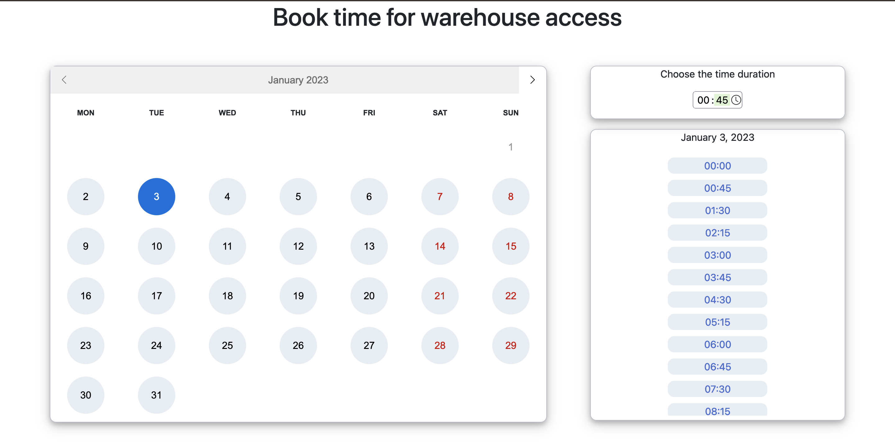

# Warehouse bookings

## Getting started

- Install docker(either vai `brew install docker` or by downloading [Docker desktop](https://www.docker.com/products/docker-desktop/))
- Install ruby `3.0`
  - rbenv - `rbenv install` in the project directory
  - rvm - `rvm install` in the project directory
- Install Node.js and yarn
- Run `bundle install`
- Run `yarn install`
- Start PostgreSQL via `docker-compose up -d`
  - this shouldn't interfere with an already existing PostgreSQL database as it is running on the `5433` port, but to be safe that there is nothing running on that same port, you can run `lsof -i :5433` beforehand to check
- Run `bin/rails db:setup` to create development and testing databases and to seed initial bookings.

### Starting the server

`bin/dev`

### Running tests

`bundle exec rspec spec`

## Further improvements

- Feature tests
- More tests for services and the `Booking` model
- SCSS and UI
  - Make the page responsive - currently built for large screens
  - Extract SCSS colors as variables
  - Add pretty loading indication when opening site & changing months
  - Make the time slot buttons ask for confirmation
- Handle available time slots for today - a user can currently select times that have already passed today.
  - Add validation for this.
  - Display the time slots correctly.
  - Maybe handle this on the front-end with regular `setTimeout`s?
- Send UTC time to the front-end at all times(currently we're sending time in client time zone from the back-end on normal requests and utc via action cable)
- Don't hide the selected day time slots once the user changes the month
  - We hide this because subscribing to updates would require a seperate websocket subscription and the way that data should be handled changes as well.
- Consider modifying our DB structure to be able to use locks instead of using advisory locks.
- Store selected context as query variables(e.g. `?month=02-2022&day=28-02-2022&duration=01:15`) in the URL to make it easier to work with the system.
- Move all text to locales and add `i18n-js` to have correct translations on the front-end
- If this was something we'd actually deploy to production
  - CI pipeline configuration
  - authentification(or at least an e-mail)
  - send e-mail with confirmation and an iCal file.
  - Use redis for actioncable
  - Depending on the expected amount of users, consider using [AnyCable](https://anycable.io/) to offload connection handling and reduce costs long-term.
